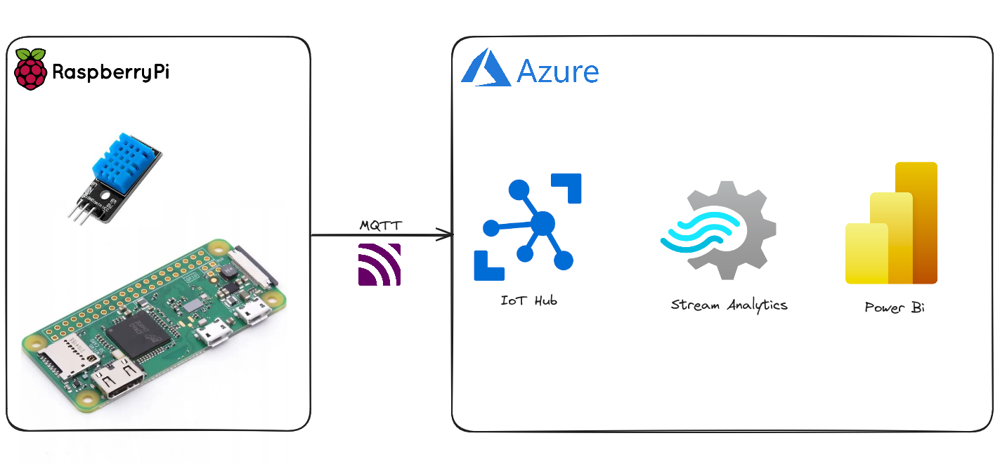

# System IoT z Integracją z Chmurą Azure i Wizualizacją w Czasie Rzeczywistym przy Użyciu Power BI

Ten projekt ma na celu zbudowanie podstawowego systemu IoT przy użyciu Raspberry Pi i czujnika DHT11, a następnie wykorzystanie go do zbierania, przesyłania i prezentowania danych w czasie rzeczywistym za pomocą chmury Azure i Power BI.

## Spis Treści

- [Wstęp](#wstęp)
- [Konfiguracja Raspberry Pi](#konfiguracja-raspberry-pi)
- [Konfiguracja Usług Chmury Azure](#konfiguracja-usług-chmury-azure)
- [Konfiguracja Power BI](#konfiguracja-power-bi)
- [Podsumowanie](#podsumowanie)
- [Załączniki](#załączniki)
- [Literatura](#literatura)

## Wstęp

Celem tego projektu jest zbudowanie podstawowego systemu IoT przy użyciu Raspberry Pi i czujnika DHT11, a następnie wykorzystanie go do zbierania, przesyłania i prezentowania danych w czasie rzeczywistym za pomocą chmury Azure i Power BI.

## Konfiguracja Raspberry Pi

Aby skonfigurować Raspberry Pi dla tego projektu, wykonaj następujące kroki:

1. Zainstaluj wymagane oprogramowanie, takie jak Imager.
2. Podłącz czujnik DHT11 do Raspberry Pi.
3. Zainstaluj niezbędne biblioteki do komunikacji z chmurą Azure i obsługi czujnika DHT11.
4. Napisz kod do zbierania danych z czujnika DHT11.

## Konfiguracja Usług Chmury Azure

Aby skonfigurować usługi Chmury Azure dla tego projektu, wykonaj następujące kroki:

1. Utwórz usługę IoT Hub.
2. Zarejestruj urządzenie IoT i uzyskaj connection string.
3. Skonfiguruj usługę Stream Analytics do przetwarzania danych.
4. Skonfiguruj wyjście do Power BI w usłudze Stream Analytics.

## Konfiguracja Power BI

Aby skonfigurować Power BI do wizualizacji danych w czasie rzeczywistym, wykonaj następujące kroki:

1. Utwórz obszar roboczy w Power BI.
2. Dodaj zestaw danych uzyskany z usługi Stream Analytics.
3. Utwórz panele nawigacyjne i wizualizacje danych w czasie rzeczywistym.

## Podsumowanie

Ten projekt pomyślnie osiąga swoje cele, tj. budowanie podstawowego systemu IoT, integrację z usługami chmury Azure i wizualizację danych w czasie rzeczywistym za pomocą Power BI.

## Literatura

- [Artykuł na Medium: Azure IoT z Raspberry Pi](https://medium.com/linkit-intecs/azure-iot-with-raspberry-pi-send-temperature-and-humidity-sensor-data-to-azure-iot-hub-using-python-d84035f3911d)
- [Dokumentacja Azure IoT Hub](https://learn.microsoft.com/en-us/azure/iot-hub/)
- [Wyjście do Power BI w Azure Stream Analytics](https://learn.microsoft.com/en-us/azure/stream-analytics/power-bi-output)
